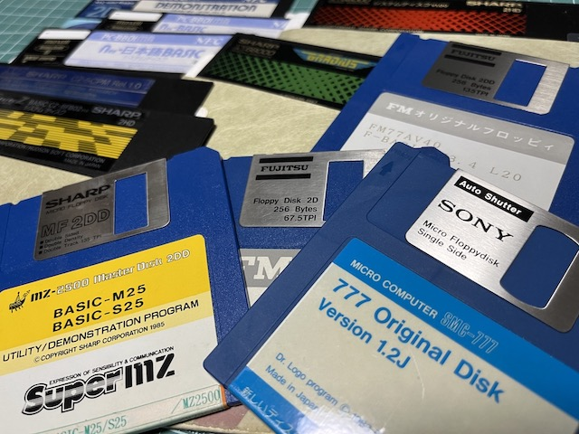

# Fdutils-aux-jp

`Fdutils-aux-jp` is an auxiliary script package for [fdutils](https://fdutils.linux.lu/) and [ddrescue](http://www.gnu.org/software/ddrescue/ddrescue.html) to operate any floppy disks for Japanese retro computers more easily. Some old floppy disk might have any damages, and so [Ddrescue](http://www.gnu.org/software/ddrescue/ddrescue.html) tries to rescue the good parts first in case of read errors and retries the bad parts.



## Setup

`Fdutils-aux-jp` requires [fdutils](https://fdutils.linux.lu/) and [ddrescue](http://www.gnu.org/software/ddrescue/ddrescue.html) on your Linux platform. On Debian and Ubuntu based distributions, install these required packages with the following command:

```
sudo apt install -y fdutils gddrescue
```

<!-- 
`Fdutils-aux-jp` is distributed as a snap package, you can install it with the dependency packages using the following command:

```
snap install fdutils-aux-jp --classic
```

However, snap adds the package name prefix into all `Fdutils-aux-jp` commands to avoid conflicting with other snap packages. Therefore, you must add the package prefix name to execute the `Fdutils-aux-jp` commands which are installed by snap as the following:

```
fdutils-aux-jp.ddrescue-x1
```
-->

## Ddrescue-*

`Ddrescue-*` are auxiliary scripts to be able to use [ddrescue](http://www.gnu.org/software/ddrescue/ddrescue.html) more easily. `ddrescue-*` set the following standard floppy parameters using `setfdprm` of [fdutils](https://fdutils.linux.lu/).

| Command          | Maker   | Computer | Structure | Media | density | head | cyl | sect | ssize | stretch |
|------------------|---------|----------|-----------|-------|---------|------|-----|------|-------|---------|
| ddrescue-x1      | Sharp   | X1       | 5.25      | 2D    | dd      | 2    | 40  | 16   | 256   | -       |
| ddrescue-x1-hd   |         |          | 5.25      | 2HD   | hd      | 2    | 77  | 16   | 256   | -       |
| ddrescue-mz      |         | MZ-2500  | 3.5       | 2DD   | dd      | 2    | 80  | 16   | 256   | -       |
| ddrescue-x68     |         | X68000   | 5.25      | 2HD   | hd      | 2    | 77  | 8    | 1024  | -       |
| ddrescue-fm7     | Fujitsu | FM-8/7   | 5.25      | 2D    | dd      | 2    | 40  | 16   | 256   | -       |
| ddrescue-fm77    |         | FM-77    | 3.5       | 2D    | dd      | 2    | 40  | 16   | 256   | 1       |
| ddrescue-fm77-dd |         | FM77AV   | 3.5       | 2DD   | dd      | 2    | 80  | 16   | 256   | -       |
| ddrescue-towns   |         | TOWNS    | 3.5       | 2HD   | hd      | 2    | 77  | 8    | 1024  | -       |
| ddrescue-66      | NEC     | 6601     | 3.5       | 1D    | dd      | 1    | 35  | 16   | 256   | 1       |
| ddrescue-88      |         | 8801     | 5.25      | 2D    | dd      | 2    | 40  | 16   | 256   | -       |
| ddrescue-88-hd   |         |          | 5.25      | 2HD   | hd      | 2    | 80  | 26   | 256   | -       |
| ddrescue-98      |         | 9801     | 5.25      | 2HD   | hd      | 2    | 77  | 8    | 1024  | -       |
| ddrescue-98      |         |          | 3.5       | 2HD   | hd      | 2    | 77  | 8    | 1024  | -       |
| ddrescue-msx     | Any     | MSX      | 3.5       | 2DD   | dd      | 2    | 80  | 9    | 512   | -       |
| ddrescue-msx-1dd |         |          | 3.5       | 1DD   | dd      | 1    | 80  | 9    | 512   | -       |
| ddrescue-smc     | Sony    | SMC-777  | 3.5       | 1DD   | dd      | 1    | 70  | 16   | 256   | -       |
| ddrescue-pc-525  | Any     | PC/AT    | 5.25      | 2HD   | hd      | 2    | 80  | 15   | 512   | -       |
| ddrescue-pc-35   |         |          | 3.5       | 2HD   | hd      | 2    | 80  | 18   | 512   | -       |

[Fdutils](https://fdutils.linux.lu/) supports only legacy (FDC-based) floppy drives, and so `ddrescue-*` can't use other floppy drives such as USB floppy drives.
You can pass any parameters same as [ddrescue](http://www.gnu.org/software/ddrescue/ddrescue.html) to `ddrescue-*`, but `ddrescue-*` set the above parameters to `/dev/fd0` statically.

## References

`Fdutils-aux-jp` is inspired by the following previous works and researches, and I would like to thank the authors.

### ddrescue

- [Ddrescue - GNU Project - Free Software Foundation (FSF)](https://www.gnu.org/software/ddrescue/)
- [GNU ddrescue Manual](https://www.gnu.org/software/ddrescue/manual/ddrescue_manual.html)
- [ddrescue - Wikipedia](https://ja.wikipedia.org/wiki/Ddrescue)
- [dd - ArchWiki](https://wiki.archlinux.org/title/Dd)
- [Disk cloning - ArchWiki](https://wiki.archlinux.org/title/disk_cloning)

### Fdutils

- [Fdutils - Linux floppy tuning utilities](http://Fdutils.linux.lu)
- [How to identify an unknown disk using Fdutils](https://Fdutils.linux.lu/disk-id.html)
- [Frequently asked question about the Linux floppy driver](http://Fdutils.linux.lu/faq.html)
- [Linux Japan 連載記事「もう少しだけLinux」2001年 3月号「第２６回 フロッピーディスクの活用」(88kB)](http://ayapin-film.sakura.ne.jp/LJ/lj.html)
- [年越しそばと初詣は絶対に欠かせない: X68k用の5inch フロッピーを読むには？](https://moimoitei.blogspot.com/2006/04/read-5inch-floppy-x68k.html)
- [PC-6601用3.5インチ1DディスクのLinuxでの読み取りに関する覚え書き](http://000.la.coocan.jp/p6/disk.html)
